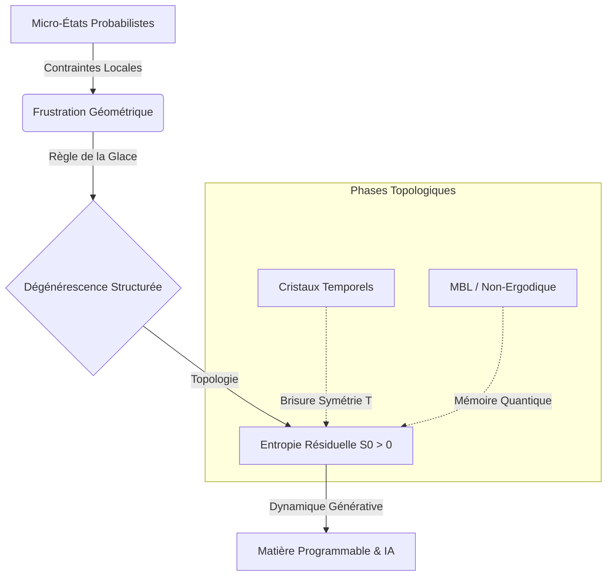

# UEA-Protocol: Architecture de l'Entropie Unifiée

> "L'entropie n'est pas une mesure du désordre, mais une structure géométrique fondamentale capable de façonner la matière et l'information au-delà de l'équilibre." [cite_start]— Architecte de l'Entropie Unifiée [cite: 3]

## 🌌 Synopsis

Le **UEA-Protocol** (Unified Entropy Architecture) propose une rupture paradigmatique dans la compréhension de l'entropie. [cite_start]Contrairement à la vision classique de la dégradation énergétique, ce framework traite l'entropie comme une ressource structurée par la **frustration géométrique**[cite: 4].

[cite_start]En intégrant la théorie de Shannon, la mécanique de Boltzmann-Gibbs et les phases topologiques (MBL, Cristaux Temporels), nous formalisons une dynamique où les contraintes locales génèrent de la complexité globale plutôt que du chaos[cite: 3, 40].

## 📐 Formalisme Mathématique

### 1. Équation d'État Généralisée (Systèmes Frustrés)
Au cœur du protocole réside la redéfinition de la dégénérescence $W$. [cite_start]L'entropie résiduelle n'est plus une simple erreur de comptage, mais une mesure de la complexité topologique[cite: 53].

$$\ln W = N \cdot \mathcal{H}_{frust} + \chi \cdot \ln \mathcal{D}$$

Où :
* $N$ : Nombre de sites du système.
* [cite_start]$\mathcal{H}_{frust}$ : Densité d'entropie résiduelle par site (dérivée des "ice rules")[cite: 62].
* [cite_start]$\chi$ : Caractéristique d'Euler de la surface (topologie globale)[cite: 63].
* [cite_start]$\mathcal{D}$ : Dimension quantique totale du système (TQFT)[cite: 67].

### 2. Hamiltonien de l'Entropie Unifiée ($\hat{H}_{AEU}$)
[cite_start]Pour modéliser la dynamique générative, nous introduisons un Hamiltonien modifié intégrant les opérateurs de flux et de charge[cite: 105]:

$$\hat{H}_{AEU} = \hat{H}_{loc} + \lambda \sum_{p} \hat{W}_{p} + \Gamma \sum_{v} \hat{Q}_{v}$$

* [cite_start]$\hat{H}_{loc}$ : Interactions locales (Heisenberg/Ising)[cite: 108].
* [cite_start]$\hat{W}_{p}$ : Opérateur de plaquette (flux) stabilisant les excitations anyoniques[cite: 112].
* [cite_start]$\hat{Q}_{v}$ : Opérateur de vertex (charge) représentant les contraintes géométriques[cite: 113].

### 3. Métrique d'Intrication Non-Ergodique (MBL)
[cite_start]Dans les systèmes qui refusent de thermaliser (Many-Body Localization), l'entropie préserve la mémoire des conditions initiales[cite: 81]:

$$S_{MBL}(L) = S_{Area} + \Delta S_{loc}$$

[cite_start]Cette métrique capture la croissance logarithmique $S(t) \propto \xi \ln(t)$ propre au régime MBL, contrairement à la croissance linéaire thermique[cite: 80, 83].

## 🔄 Architecture & Flux (Mermaid)

## 📊 Prédictions & Comparatifs

Le passage de la matière classique à la matière programmable topologique permet une nouvelle ingénierie de la création.

| Caractéristique | Matière Classique | Matière Programmable (UEA) |
| --- | --- | --- |
| **Rôle de l'Entropie** | Dégradation, perte de signal | Ressource de stockage, protection 

 |
| **Dynamique** | Thermale, dissipative (Ergodique) | Générative, Non-Ergodique 

 |
| **Support d'Info** | États magnétiques locaux | Classes d'homotopie, liens topologiques 

 |
| **Résilience** | Sensible aux perturbations locales | Immunité topologique globale 

 |

## 🚀 Applications

1. 
**Matière Programmable** : Utilisation de la "chirurgie topologique" pour manipuler les monopoles et reprogrammer les propriétés mécaniques/magnétiques.

2. 
**IA de Nouvelle Génération** : "Régularisation par Frustration" pour lisser les paysages de perte (loss landscapes) et éviter la thermalisation prématurée des réseaux de neurones.

3. 
**Calcul Quantique** : Exploitation des cristaux temporels pour des horloges quantiques stables défiant le second principe.

## 📚 Référence

Ce dépôt est basé sur le document fondateur : *"Architecture de l'Entropie Unifiée : Dynamiques Génératives, Frustration Géométrique et Phases Topologiques"*.

